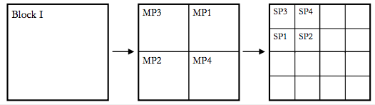

```{r echo=FALSE,message=FALSE,warning=FALSE}
library(lme4)
library(lmerTest)
library(pbkrtest)
library(emmeans)
library(ggplot2)
library(car)
library(multcomp)
```

---


This homework follows from Lab 8. You'll analyze the Split-Plot Oats dataset in several different ways and compare results.

The experiment is modified slightly. Now rather than 4 blocks in one field, the experiment
was done over 4 fields, with each Fertilizer treatment applied once to a single section of each field.

In this study, four different fertilizers were randomized within four MainPlots in each of four fields. 
Four different varieties of oats were randomized within four subplots separately in each of the sixteen main plots. 
The experiment was run as a split-plot because the fertilizers could only be applied to large sections of the field,
while the oat varieties could be randomized to smaller plots within each section.

For the following analyses, we'll assume the the Blocks are actually four separate fields.

- Fields: Four
- Main plots (Fertilizer): Four
- Subplots (Variety): Four (includes one control, V1)



```{r}
oats_data = read.csv('Oats_Field.csv')
str(oats_data)
```

The following code fits the model demonstrated in lab:

```{r}
fixed_block_model = lmer(Yield ~ Fertilizer + Field + (1|MainPlot) + Variety + Fertilizer:Variety + Variety:Field,oats_data)
```

## Question 1. Split Plot RCBD with Random blocks

### 1.1 Describe the experiment in detail
Modify the experimental table from Lab 8 for the case where the four Fields are considered random.

**Design**: Split-plot with RCBD on main plots


| Structure | Variable                      | Type        | # levels | Experimental Unit          |
|-----------|-------------------------------|-------------|----------|----------------------------|
| Treatment |Fertilizer                     |Cat          | 4        | Fertilier:Field            |
|           |Variety                        |Cat          | 4        | Variety:Field              |
|           |Fertilizer:Variety             |Cat          | 16       | Var:Fertilizer:Field       |
| Design    |Main plot                      |Cat          | 16       |                            |
|           |Subplot                        |Cat          | 64       |                            |
|           |Field                          |Cat          | 4        |                            |
|           |Variety:Field                  |Cat          | 16       |                            |
|           |Field:Fertilizer               |Cat          | 16       |                            |
|           |Fertilizer:Field:Variety       |Cat          | 64       |                            |
|           |Fertilizer:Variety:Main Plot   |Cat          | 64       |                            |
|           |Variety:Main Plot              |Cat          | 64       |                            |
| Response  |Yield                          |Numeric      | 64       |                            |

### 1.2 Describe how your conclusions from this analysis will differ from those from lab.
Don't analyze the data yet. Just describe how statements about effects you observe will change in this case.

> In this case, there are 4 fields/mainplots instead of 4 sections of a field. The fields are now random allowing us to extrapolate the results to not just these fields but also other fields. 

### 1.3 Fit an appropriate linear model to the data
Modify the following code from lab according to account for the random blocks
```{r}
# use the following name for your model by removing the '#' and filling in the rest
random_block_model = lmer(Yield ~ Fertilizer + Variety + Fertilizer:Variety + (1|Field) + (1|Fertilizer:Field) + (1|Variety:Field), data = oats_data) 
```

### 1.4 Make ANOVA tables for the `fixed_block_model` and `random_block_model`
List differences between the results. Ignore rows involving `Block`, and focus on `Mean Sq`, `NumDF`, `DenDF`, `F.value`, and `Pr(>F)`
Which results are the same? Which are different?

Fixed Blocks ANOVA:
```{r}
# from lab:
anova(fixed_block_model,ddf='K')
```

Random Blocks ANOVA:
```{r}
anova(random_block_model, ddf='K')
```

> As for similarities, for both models Fertilizer;Variety and Fertilizer had the exact same values for both models. For Variety, from the fixed block to the random block: the SST went down, MST decreased, DF stayed the same, F value decreased, and the p-value increased (but was non-significant for both models). The fixed block model also includes Field and Field;Variety as treatments which no longer appear in the random block model as these are now made random. 

### 1.5 In lab, we observed that different comparisons of specific combinations of Fertilizer and Genotype were estimated with different SEs (last part of section "Means comparisons").
Using the same code, inspect the SEs of all pairwise comparisons of combinations of Fertilizer and Genotype for the model with **random blocks**.
There are now three different "classes" of comparisons, each with a different SE. What are these three classes?
```{r}
means = emmeans(random_block_model, specs = c('Fertilizer','Variety'),lmer.df = 'K')
all_differences = contrast(means,method = 'pairwise')
all_contrasts = as.data.frame(all_differences)
all_contrasts <- as.data.frame(all_contrasts)
all_contrasts[order(all_contrasts$SE),]
```


> Class #1  (SE = 3.68, df = 33.92),compares different varieties with the same fertilizer. 
> Class #2 (SE = 4.15, df = 27.19) compares the same variety between different fertilizers. 
> Class #3 (SE = 4.38, df = 30.70) compares different varieties with different fertilizers.

---

**To explore these differences, we will split the analysis into an analysis of the Fertilizers, and a separate analysis of Varieties**

## Question 2

If we ignore Variety, we can analyze Fertilizer by itself by averaging up to its experimental units.
To do this, we can average the four SubPlots per MainPlot into a single value, resulting in a new smaller dataset.

The following code does this averaging and produces a new data-frame with one observation per MainPlot:
```{r}
mainPlot_data = aggregate(Yield~MainPlot+Fertilizer+Field,oats_data,mean)
str(mainPlot_data)
```

### 2.1 Describe this subset of the experiment in detail, assuming Fields are fixed
This would be our analysis if we were only interested in *these four fields*.
Describe as if this were the only data available

**Design**:RCDB

| Structure | Variable          | Type        | # levels | Experimental Unit |
|-----------|-------------------|-------------|----------|-------------------|
| Treatment |Fertilizer         |Cat          |   4      |  Main plot        |
| Design    |Field              |Cat          |   4      |                   |
|           |Mainplot           |Cat          |   16     |                   |
|           |Fertilizer:Field   |Cat          |   16     |                   |
|Response   |Yield              |Num          |   16     |                   |


### 2.2 Fit a linear model to the `mainPlot_data`, and present an ANOVA table
```{r}
mainPlot_fixed = lm(Yield ~ Fertilizer + Field, mainPlot_data)
anova(mainPlot_fixed)
```


### 2.3 Repeate assuming Blocks are random
This would be our analysis if our fields were a random sample of set of possible fields,
and we wished to make general recommandations for all fields.

**Design**: RCDB

| Structure | Variable          | Type        | # levels | Experimental Unit |
|-----------|-------------------|-------------|----------|-------------------|
|Treatment  | Fertilizer        |Cat          | 4        | Fertilizer:Field  |
|Design     | Field             |Cat          | 4        |                   |
|           | Main Plot         |Cat          | 16       |                   |
|           | Fertilizer:Field  |Cat          | 16       |                   |
|Response   | Yield             |Num          | 16       |                   |


### 2.4 Fit a linear model to the `mainPlot_data`, and present an ANOVA table
```{r}

mainPlot_random = lmer(Yield ~ Fertilizer + (1|Field), mainPlot_data)
anova (mainPlot_random, ddf = 'K')
```


### 2.5 Compare the conclusions from these two models about the effects of Fertilizer to the conclusions from the full Split-plot models.
Did treating Block as random affect the conclusions?

> The results for Fertilizer is the same for both models and is significant according to both ANOVAs. Treating field as random had no effect on the signficance of Fertilizer and did not significantly impact the experiment. 

----

## Question 3

You'll now study the original data for Variety, ignoring Fertilizer.

This design is one we haven't seen before directly. 

We have two hierarchical levels of blocking: 4 Fields, each with 4 MainPlots.

This is called a **Replicated RCBD**. There are effectively 4 replicates of a RCBD, each with 4 different blocks.
The MainPlots are our normal Blocks, and the Fields are now our replications of this experiment.
We say that MainPlots are **nested** in experiment replicates.

### 3.1 Describe this experiment in detail, assuming Fields are fixed
**Note**: We should assume MainPlot is Random. It has to be random given that the whole experiment is a split plot.

**Design**: Replicated RCBD with fixed Reps (Fields) and random blocks (MainPlots)

| Structure | Variable          | Type        | # levels | Experimental Unit            |
|-----------|-------------------|-------------|----------|------------------------------|
| Treatment |Variety            |Cat          | 4        |  subplot or variety:mainplot |
| Design    |field              |Cat          | 4        |                              |
|           |mainplot           |Cat          | 16       |                              |
|           |subplot            |Cat          | 64       |                              |
|           |variety:Field      |Cat          | 16       |                              |
|           |Variety:MainPlot   |Cat          | 64       |                              |
| Response  |Yield              |Num          | 64       |                              |


### 3.2 Repeat this table, assuming Fields are random

**Design**: Replicated RCBD with Random Reps (Fields) and random blocks (MainPlots)

| Structure | Variable          | Type        | # levels | Experimental Unit            |
|-----------|-------------------|-------------|----------|------------------------------|
| Treatment |Variety            | Cat         | 4        |  Variety:blocks              |
| Design    |Field              | Cat         | 4        |                              |
|           |MainPlot           | Cat         | 16       |                              |
|           |Subplot            | Cat         | 64       |                              |
|           |Variety:Block      | Cat         | 16       |                              |
|           |Variety:MainPlot   | Cat         | 64       |                              |
| Response  |Yield              | Num         | 64       |                              |


### 3.3 Fit a linear model to the `oats_data` based on the above table (ignoring Fertilizer, and with Blocks as random).
I've provided the model with fixed blocks.
Which model provides stronger evidence for differences among varieties?

Fixed blocks:
```{r}
subPlot_model_fixed = lmer(Yield ~ Field + (1|MainPlot) + Variety + Variety:Field,oats_data)
anova(subPlot_model_fixed,ddf='K')
```

Random blocks:
```{r}

subPlot_model_random = lmer(Yield ~ Variety + (1|Field) + (1|MainPlot) + (1|Variety:Field), oats_data)
anova(subPlot_model_random, ddf='K')
```

> For both models none of the treatments have a significant p-value suggesting the none of the treatments have a significant effect. If anything, the fixed block model is better as the p-value for variety is slightly smaller (0.27 vs 0.37) than the p-value for random block model. 

### 3.4 Using both models, form 95% confidence intervals around the estimated difference between Variety_1 and Variety_2
Are the estimates different? The confidence intervals? 
In one sentence each, describe how to interpret each confidence interval

Fixed blocks (Fields) model:
```{r}
fixed_means = emmeans(subPlot_model_fixed,specs = 'Variety',lmer.df = 'K',at = list(Variety = c('V1','V2')))
summary(contrast(fixed_means,method = 'pairwise'),infer = c(T,F))
```

Random blocks (fields) model:
```{r}
random_means = emmeans(subPlot_model_random,specs = 'Variety',lmer.df = 'K',at = list(Variety = c('V1','V2')))
summary(contrast(random_means,method = 'pairwise'),infer = c(T,F))
```

> The estimate is the same for both models. The confiderence interval for the random model is bigger in the random block model compared to the fixed model likely due to the decrease in the degrees of freedom from 36 to 9 and the increase in SE from 2.05 to 2.2. 

### 3.5 Compare the ANOVA test on Variety from these models to the Variety test from the SplitPlot models of Question 1.
Which are the same? Which are different?
*Note*: I've provided the code. If you used the model names I suggested above, this should work directly.

Models only with Variety:

Field Fixed:
```{r}
anova(subPlot_model_fixed)
```
Field Random:
```{r}
anova(subPlot_model_random,ddf='K')
```

Models with full data

Field Fixed:
```{r}
anova(fixed_block_model)
```

Field Random:
```{r}
anova(random_block_model,ddf='K')
```

> For the models with only Variety- the SS, estimate, and p-value are all different. For neither field random or fixed models is Variety significant. However, in the fixed field model, Field is bordering on significance. 

>For the models with the full data, the significant interaction Fertilizer:Variety was absent from the
the split plot models. Here the error and the p-values for Fertilizer:Variety have changed.

> Variety for random models is not significant and the p-values are the same. However, the SST and MS increased
for the subPlot_model_random, due to the effect of an interaction not accounted for by the model. 


