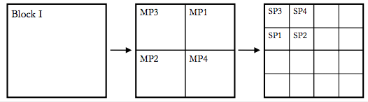

```{r}
library(ggplot2)
library(emmeans)
library(lme4)
library(lmerTest)
library(pbkrtest)
library(car)
```


## Split Plot with a RCBD as a main plot.
Split plots are used when a factorial design is necessary, but the two factors require different
levels of randomization. The randomization takes two stages, first the main plot treatments among the main plots, 
and then the sub-plot treatments inside of each main plot. 
Because of this two-stage process, one looses sensitivity in detecting differences among main plot treatments (the first level of randomization) 
but gains sensitivity in detecting differences among subplot treatments (the second level), 
as well as the significance of the MainPlot*Subplot interaction.

In this study, four different fertilizers (main plots) were randomized within four blocks, 
and four different varieties of oats (subplots) were randomized within each of the sixteen main plots. 
The experiment was run as a split-plot because the fertilizers could only be applied to large sections of the field,
while the oat varieties could be randomized to smaller plots within each section.

- Blocks: Four
- Main plots (Fertilizer): Four
- Subplots (Variety): Four (includes one control, SP1)

```{r}
oat_data = read.csv('Oats.csv')
str(oat_data)
```

### Model table

Here's a diagram of the experiment. It can be helpful to draw this out for your experiment


**Design**: Split plot with RCBD as a main plot

| Structure | Variable                      | Type        | # levels | Experimental Unit                     |
|-----------|-------------------------------|-------------|----------|---------------------------------------|
| Treatment | Fertilizer                    | Categorical | 4        | MainPlot or Fertilizer:Block          |
|           | Variety                       | Categorical | 4        | SubPlot or Variety:Block              |
|           | Fertilizer:Variety            | Categorical | 16       | SubPlot or Fertilizer:Variety:Block   |
| Design    | Block                         | Categorical | 4        |                                       |
|           | MainPlot                      | Categorical | 16       |                                       |
|           | SubPlot                       | Categorical | 64       |                                       |
|           | Fertilizer:Block              | Categorical | 16       |                                       |
|           | Variety:Block                 | Categorical | 16       |                                       |
|           | Fertilizer:Variety:Block      | Categorical | 64       |                                       |
|           | Variety:MainPlot              | Categorical | 64       |                                       |
|           | Fertilizer:Variety:MainPlot   | Categorical | 64       |                                       |
| Response  | Yield                         | Numeric     | 64       |                                       |


There's a lot going on in this table. 

#### Variables

- I started with the two treatments and their interaction.
- I then added the 3 components of the Experimental Design: Block, MainPlot, SubPlot
- I then added terms for all possible combinations between Treatment and Design terms.
    - When one term is *Nested* in another term, there are no additional combinations. 
        - Ex: MainPlot is nested in Fertilizer. Each MainPlot contains a single Fertilizer.
    - When two terms are *Crossed*, we add the combinations.
        - Ex: Block is crossed with: 1) Fertilizer (all Fertilizers in all Blocks), 2) Variety, and 3) the Fertilizer:Variety combinations.
        - Ex: MainPlot is crossed with Variety (all Varieties in each MainPlot)
        
#### Experimental Units

We need experimental units for the 3 treatment variables: *Fertilizer*, *Variety*, and *Fertilizer:Variety*

We have two choices of experimental units for each variable, depending on the goal of the experiment.

This experiment was run in a single field. We divided the field into 4 blocks, and ran the split-plot in each block.

- If the goal was to make recommendation for all possible blocks, we would use the *Block:Trt* terms as Experimental units
- If the goal is to use the blocks to control variation within *this field*, then we would use *MainPlot* or *SubPlot* as Experimental Units.

Here, extrapolating to new blocks doesn't really make sense. There are no other blocks to extrapolate to. 
Sections in other fields may perform differently than these 4 sections in this field.
So, there's really no advantage to be gained by considering Blocks as Random.

Given this, we'll analyze more as a Factorial with Blocks another factor.
We can test for Block:Trt interactions, and then report main-effects if these interactions are not very large.
We'll have to remember that the Variety and Fertilizer effects we report, are **average** effects, averaged across 
plots in **this particular field**.

> So, given this, how do we decide on the Experimental Units?

*Fertilizer*: Fertilizers were random assigned to MainPlots (within each Block). Therefore, MainPlot is the Experimental Unit.
*Variety*: Varieties were randomly assigned to SubPlots (within each MainPlot). Therefore, SubPlot is the Experimental Unit.
*Fertilizer:Variety*: Specific combinations of Fertilizer and Variety were randomly assigned within SubPlots (within each MainPlot).

### Linear Model

Now that we have layed out our experiment, we can write our linear model.

First, we have to identify which terms to include in the model.

Rules:

1. Start with all terms.
2. Remove any terms that have the same # levels as the Response
3. When two terms are *aliased*, include only one (either will give the same answer)
4. Declare all terms that are Experimental Units of other terms *Random*. 
5. Also declare any terms that are nested within *Random* terms to be *Random*.

We have 3 terms with the same # levels as *Yield*. None of these can be included in the final model.

#### Aliased terms
Terms that have the same # levels *MAY* be aliased.

Consider *MainPlot* and *Fertilizer:Block*. These both have 16 levels.

- Each Block has 4 MainPlots, each with a single Fertilizer.
- Each Fertilizer:Block combination is present in a single MainPlot.

These terms are *aliased*.

We can see that with `table`:
```{r}
# make a new column in the data for Fertilizer:Block
oat_data$Fert_Block = interaction(oat_data$Fertilizer,oat_data$Block,drop = TRUE)
table(oat_data$Fert_Block,oat_data$MainPlot)
```

In this matrix, columns are the 16 MainPlots, and rows are each of the combinations of Fertilizer and Block.

Each cell counts the number of observations of each combination. Each row/column only has a single non-zero entry. Thus they are *aliased*.

> This means that we can either include *MainPlot* OR *Variety:Block* in our model, but not both.

Since *MainPlot* is our experimental unit for Variety, we should use that in our model.

*Fertilizer:Variety* and *Variety:Block* also have 16 levels in our table. However, these are *Partially Crossed*
with eachother and with *MainPlot* (ie, not all combinations are present, but > 1 are)

> Convince yourself of this! Make the tables.

```{r}
oat_data$Fert_Var = interaction(oat_data$Fertilizer,oat_data$Variety,drop = TRUE)
table(oat_data$Fert_Var,oat_data$MainPlot)
```

*answer* Note that each row has more than one non-zero value.

Now, we can write our model. Split Plots always require `lmer` because they have multiple Experimental Units.
*MainPlot* will ALWAYS be random!

```{r}
oats_model <- lmer(Yield ~ Fertilizer + Variety + Fertilizer:Variety +  # treatment terms
                           Block + (1|MainPlot) + # Design terms. SubPlot not included because aliased with Yield 
                           Variety:Block # Fertilizer:Block is not included because we included MainPlot and they are aliased
                           # Fertilizer:Variety:Block, Variety:MainPlot, Fertilizer:Variety:MainPlot - not included because aliased with Yield
                          ,data = oat_data
                          )
```

### Diagnostics

For the diagnostics of a Split-plot experiment, we have to do diagnostics on **all experimental units**.
We have two different experimental units for the three treatments:

- *MainPlot* for Fertilizer
- *SubPlot* for Variety and Fertilizer:Variety

The *SubPlot* experimental units are aliased with the observations. 
Therefore we can access the estimates of these EU's with the `resid()` function.
We can make the qqplot and S/L plots like this:
```{r}
par(mfrow=c(1,2))
## qqplot
qqPlot(resid(oats_model))
## S/L plot
fitted_values = fitted(oats_model)
abs_sqrt_resids = sqrt(abs(resid(oats_model,scaled=T)))
scatter.smooth(fitted_values,abs_sqrt_resids,span = 1,main = 'Scale-Location',ylab = expression(sqrt(abs(' deviations '))),xlab = 'Fitted values')
```

> These all look pretty good.

Now, for the *MainPlot* experimental units, we have to estimate their values like we do in normal `lmer()` models.
Actually, the processes here is slightly more involved.
To get the estimate values, we have to fit a reduced model with *no subplot* terms.
We can get the estimates from this model:

```{r}

# No-subplot-model: Same as oats_model, but only variables that are constant within each mainplot

mainplot_model <- lmer(Yield ~ Fertilizer +  # treatment terms
                           Block + (1|MainPlot) # Design terms. SubPlot not included because aliased with Yield 
                          ,data = oat_data
                          )
# Now, using this model, the code is similar to what you have seen before

par(mfrow=c(1,2))

# 
# Step 1: Extract estimates of the experimental unit deviations
eu_data = aggregate(Yield ~ Fertilizer + Block + MainPlot,oat_data,FUN = mean)
  # Again, include all terms in the mainplot_model
  # you'll have to adapt this for other experiments with other Variables
eu_data$deviation = ranef(mainplot_model)$MainPlot[eu_data$MainPlot,1]
  # The key above is to substitute `Plot` for the name of your random experimental unit term above in both places
# emmeans(oats_model,specs = 'MainPlot',lmer.df = 'K')
eu_data$fitted = predict(mainplot_model,newdata = eu_data,re.form = ~0)
  # This line you can use directly
# 
# # Step 2: Make QQplot and `Scale-Location` plot:
# op = par(mfrow=c(1,2))  # two plots side-by-side
qqPlot(eu_data$deviation,main = 'Plot (EU) Normal Q-Q',pch=19)  # new qqplot function
scatter.smooth(eu_data$fitted,sqrt(abs(eu_data$deviation)),span = 1,main = 'Scale-Location',ylab = expression(sqrt(abs(' deviations '))),xlab = 'Fitted values')
```

> all diagnostics look fine here too.

### Analysis

Our analysis of a SplitPlot is really just like for a factorial (it is just a factorial!)

ANOVA:
```{r}
anova(oats_model,ddf='K')
```

We analyze this like a 3-way factorial, except we are missing one of the 2-way interactions, and the 3-way interactions.

#### Questions

> Should you report main effects or specific effects for Fertilizer and Variety?
> What about Block:Trt? Can you report main effects for Variety? Fertilizer?

> Note: Fertilizer has 9 DenDF, but Variety has 27. Why? 
What will this do to our confidence intervals for each term?

*answers*: 
We should report specific effects because Fertlizer:Variety is important (p < alpha = 0.05)
The Block:Variety effect is not large, so variety effects don't change much across the Blocks
Fertilizer has fewer DenDF because it was randomized at a higher level and so only has 16 EU total.
Variety was randomized within the MainPlots, so has 64 total EU


### Means comparisons

Since we see evidence that the Fertilizer effects are dependent on the particular varieties, 
we should report simple effects of Fertilizer for each variety. The syntax is straightforward:
```{r}
oats_means = emmeans(oats_model,specs = 'Fertilizer',by='Variety',lmer.df = 'K')
cld(oats_means,level = 0.05/4) # adjusted for 4 sets of comparisons (4 varieties)
```

Had we wanted main effects, we could get them as expected:
```{r}
# Fertilizer effects
oats_main_effects_fertilizer = emmeans(oats_model,specs = 'Fertilizer',lmer.df = 'K')
cld(oats_main_effects_fertilizer)
```
```{r}
# Variety effects
oats_main_effects_variety = emmeans(oats_model,specs = 'Variety',lmer.df = 'K')
cld(oats_main_effects_variety)
```

> Note: the standard errors and df's are different for the two types of treatments.


We could also make comparisons between all specific combinations of Fertilizer and Variety
```{r}
all_means = emmeans(oats_model,specs = c('Fertilizer','Variety'),lmer.df = 'K')
all_differences = contrast(all_means,method = 'pairwise')
all_contrasts = as.data.frame(all_differences)
all_contrasts <- as.data.frame(all_contrasts)
all_contrasts[order(all_contrasts$SE),]  # I'll sort the contrasts by their SE
```

> Page through the table of contrasts. 

> Note that there are different standard errors and different df's for different comparisons. What type of comparisons is the most precise?

